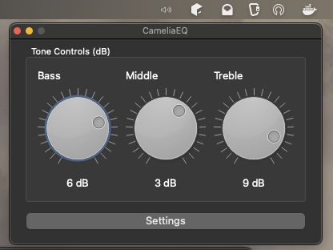

# CameliaEQ: a CamillaDSP Equalizer GUI 
[](https://www.gnu.org/licenses/gpl-3.0)

Simple tray app for macOS/Linux to control Bass/Middle/Treble gains in a CamillaDSP config.



## Background
There are few free and open source equalizers for macOS and Linux. Of course there is
__eqMac__, but it's troublesome while switching devices, and random crashes, so I've decided 
to find an alternative solution.

Fortunately, there is one: BlackHole driver + CamillaDSP. Unfortunately, it's hard to use
by non-experienced users because it was created for more professional use cases.
Instead of using extensive CamillaGUI, which needs some programming knowledge, I've decided
to create a project that simply allows changing Bass/Middle/Treble gains.

## Disclaimer:
This application is PoC that during development I used to test features of IntelliJ's 
Juno Ai assistant. 

I did review and modified the resulting code, but there might be some bugs and flaws. 
As LICENSE says: I'm not responsible for any harm that could happen during usage of
this software. I've created this just for my use and decided to share it with others.

## Running the app
### Requirements
- Python 3.9+
- blackhole-2ch installed
- running CamillaDSP

### Notes
Settings are stored in a user config file `settings.yml`. Paths:
- macOS `~/Library/Application Support/CameliaEQ/settings.yml`
- Linux `~/.config/CameliaEQ/settings.yml`.

## macOS

### 1. Install BlackHole driver
```commandline
brew install --cask blackhole-2ch
```
___

### 2. Install CamillaDSP (the trickiest part)
- Download and extract a specific version for your computer https://github.com/HEnquist/camilladsp/releases/tag/v3.0.1

###### Next steps will contain placeholders you need to replace:
- `<DIRECTORY_TO_CAMILLADSP>` with your directory to `camilladsp`
- `<WEBSOCKET_PORT>` to control CamillaDSP over WebSocket. If you don't know what it means, put `1234`
- `<CONFIG>` configuration file you'd like to use

#### macOS (tested on 15.6.1)
- Open terminal and go to directory with `camilladsp` executable
- Create new CamillaDSP config file with title, all other properties will be set by the app:
  ```
  mkdir config
  nano config/<CONFIG>.yml
  echo title: CameliaEQ >> config/<CONFIG>.yml
  ```
- Check if you are able to run CamillaDSP 
  ```
  ./camilladsp -w -p<WEBSOCKET_PORT> <DIRECTORY_TO_CAMILLADSP>/configs/<CONFIG>.yml
  ```
  
  __If you receive prompt about untrusted software, app is under system quarantine. To remove quarantine run, and retry:__ 
  ```
  xattr -d com.apple.quarantine <DIRECTORY_TO_CAMILLADSP> 
  ```

  __If it's running. Just press `cmd+c` to close the app__
- Prepare a startup file with a command `nano ~/Library/LaunchAgents/com.github.camilladsp.startup.plist` 
  and save it with this content:
  ```
  <?xml version="1.0" encoding="UTF-8"?>
  <!DOCTYPE plist PUBLIC "-//Apple//DTD PLIST 1.0//EN" "http://www.apple.com/DTDs/PropertyList-1.0.dtd">
  <plist version="1.0">
  <dict>
    <key>Label</key>
    <string>com.githum.camilladsp.startup</string>
    <key>ProgramArguments</key>
    <array>
      <string><DIRECTORY_TO_CAMILLADSP>/camilladsp</string>
      <string>-w</string>
      <string>-p<WEBSOCKET_PORT></string>
      <string><DIRECTORY_TO_CAMILLADSP>/configs/<CONFIG>.yml</string>
    </array>
    <key>RunAtLoad</key>
    <true/>
  </dict>
  </plist>
  ```
- Launch on system log-in:
  ```commandline
  launchctl load ~/Library/LaunchAgents/com.github.camilladsp.startup.plist
  ```

___
### 3. Run CameliaEQ
There are two options to run the app. If you are not familiar with python, and you don't want to learn it, 
I'd recommend you to run the app from executable:

- Download and extract executable from Releases page in this repo valid for your system
- Double click the app icon, or run in commandline:
  ```commandline
  ./cameliaEQ
  ```
  - Go to `Settings` and set CamillaDSP config file that was set previously

### 4. Build executable from sources
   - Install pyinstaller:
   ```commandline
     pip install pyinstaller
   ```
   - Go to the directory to which this repository is downloaded
   - Create new virtual environment:
     ```commandline
     python3 venv venv
     ```
   - Activate the environment:
     ```commandline
     source venv/bin/activate
     ```
   - Install python dependencies:
     ```commandline
     pip install -r requirements.txt
     ```
   - You can run the app via command line directly:
     ```commandline
     python -m cameliaeq
     ```
   - Or build executable - go to `cameliaeq` and execute command, your executables should be in `/cameliaeq/dist`:
     ```commandline
     pyinstaller --onefile --icon=../icon.icns --name="cameliaEQ" __main__.py
     ```

### Autostart
Of course you can add this to system autostart - check the web or LLM for details.

___
## Linux (TBD)
